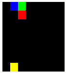
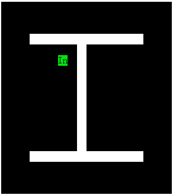

[:uk: English](./README.md) / [:cn: 中文](./README-CN.md)

# Snake-AI

这是一个用c/c++语言编写的贪吃蛇游戏的人工智能。

AI的目的是让蛇尽可能的吃更多的食物，直到吃满整个地图。

想参与这个项目，请查看[todos](#todos)。

## 效果展示



## 使用方法

编译与运行：

```bash
$ make
$ make run
```

为了解详细使用方法, 请查看主函数[main()](./src/main.cpp)

## 键盘控制

| 按键 | 功能 |
|:--:|----|
|W|上移|
|A|左移|
|S|下移|
|D|右移|
|Space|（暂停/恢复）蛇的移动|
|Esc|退出游戏|

## 算法介绍

* 函数[Snake.decideNext()](./src/Snake.cpp): 计算蛇***S1***的下一个移动方向***D***

  1. 计算从蛇***S1***的头部到达食物的最短路径***P1***。

  2. 派一条与蛇***S1***完全一样的虚拟蛇***S2***沿路径***P1***吃掉食物。

  3. 计算从蛇***S2***的头部到其尾部的最长路径***P2***。如果路径***P2***存在，将移动方向***D***设置为路径***P1***的第一个方向，否则进行步骤4。

  4. 计算从蛇***S1***的头部到达其尾部的最长路径***P3***。如果***P3***存在，将移动方向***D***设置为路径***P3***的第一个方向，否则进行步骤5。

  5. 将移动方向***D***设置为离食物最远的方向。

* 函数[Map.findMinPath()](./src/Map.cpp): 计算两个位置间的最短路径

  算法建立在BFS的基础上。为了使路径尽可能直，每次遍历邻接点时，在当前移动方向上的位置会被优先遍历。

  效果展示:

  （绿色区域为搜索算法扫描到的区域，红色区域为最后计算出的最短路径，每个位置上的数字表示了从起始位置开始到该位置的最短距离）
  
  
  
* 函数[Map.findMaxPath()](./src/Map.cpp): 计算两个位置间的最长路径

  算法建立在DFS与贪心算法的基础上。每次遍历邻接点时，离目标位置最远（使用曼哈顿距离估计）的位置将会被优先遍历到。另外，为了使路径尽可能直，如果两个位置到目标位置的距离相等，在当前移动方向上的位置将被优先遍历到。这个问题是一个NP完全问题，此算法得出的结果路径只是一个近似最长路径。
  
  效果展示:

  （绿色区域为搜索算法扫描到的区域，红色区域为最后计算出的最长路径，每个位置上的数字表示了从该位置开始到目标位置的估计距离）
  
  
 
## Todos

优化AI算法:

当前的AI算法仍然不完美，有时候蛇会进入一个无解的情况（运行程序即可看到）。

一些可能的解决方案:
  
| # | 方案 | 已实现? | 评论 |
|:-:|----|:----:|----|
|1|~~当一个空白位置的邻接位置中有一个蛇头和一个蛇尾时，不要在这个位置放置食物。~~|No|尽管此方法可以避免一些无解情况，但它修改了游戏规则，并没有修改AI算法本身。因此已经没有实现的必要。|
|2|让搜索出的结果路径包含最少的拐角，即尽可能直。|Yes|算法是有效的。如果蛇行走的路径尽可能直，最后地图上留下的空白位置就不会太分散，从而让蛇有更大的概率吃满整个地图。|
|3|当搜索从蛇头通往食物的最短路径时，考虑搜索每深入一层，原本蛇尾的位置将会空出来。|No|等待实现。|

**为了参与此项目，你可以评论或者实现上述的解决方案，或者添加你认为可行的解决方案。**

## License

See the [LICENSE](./LICENSE) file for license rights and limitations.
