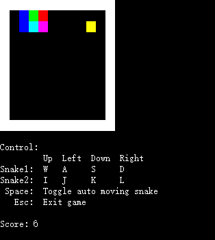
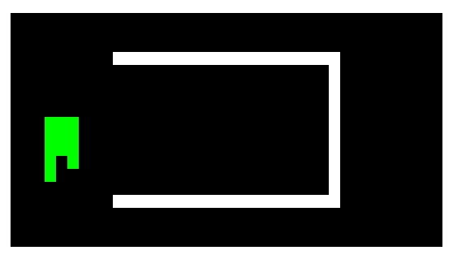
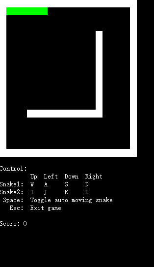

# Snake-AI

A snake game AI written in c/c++.

## This program can be used to

1. Play classic snake game. (You can control two snakes at the same time)

2. Watch how an AI snake eat the food. (Also, you can see two AI snake running at the same time)

3. Run some test program for graph searching alogrithm such as BFS and DFS.
	
## Demos

AI:

1. Single snake

   
   
2. Double snake(experimental)

   
   
Algorithm test

(The green area is scanned by the search algorithm. The red area is the result path):

1. BFS

   

2. BFS + A*

   

3. DFS(longest path)

   

## Compile and Run

Windows:

	Compile and run with Visual Studio or g++.
	
Linux:

```bash
$ cd src
$ make
$ make run
$ make clean
```
	
## Usage

```c++
int main() {
    auto game = GameCtrl::getInstance();

    // Set map's size. Default is 20*20
    // The minimum size is 4*4.
    game->setMapRow(20);
    game->setMapColumn(20);

    // Set FPS. Default is 60.0
    game->setFPS(59.0);

    // Set whether to make the snake automove. Default is true
    game->setAutoMoveSnake(true);

    // Set interval time(ms) for automove. Default is 200 ms.
    // If setAutoMoveSnake(false), this code is useless.
    game->setAutoMoveInterval(50);

    // Set whether to enable the second snake. Default is false
    game->setEnableSecondSnake(true);

    // Set whether to enable the snake AI. Default is false
    // If setAutoMoveSnake(false), this code is useless.
    game->setEnableAI(true);

    // Set whether to run the test program. Default is false
    // Set the map size to 20*40 before setting this to true.
    game->setRunTest(false);

    // Set whether to write the map content to the file. Default is false
    // If set this attribute to true, the game map content will be written
    // to a file named "movements.txt" after each snake's movement.
    // PS: This is designed for debugging. Open this method may make the
    // snake move slower.
    game->setWriteToFile(false);

    return game->run();
}
```

## Todos

1. Optimize graph search algorithm

   In the algorithm of AI, finding shortest and longest path is needed. A* algorithm is used to find the two kinds of path. Perhaps the heuristic value could be enhanced. 

2. Optimize AI algorithm.

   Current AI algorithm is not the best. There are some situations in which the snake will kill itself after moving.

3. Use GUI library instead of console to run the program.

   This program uses different console output color to show the game, which weakens the effect. Using a GUI library such as OpenGL to show the game would be better. 

## References

* [Introduction to A*](http://theory.stanford.edu/~amitp/GameProgramming/AStarComparison.html)

## License

Copyright 2016 ChuyangLiu

Licensed under the Apache License, Version 2.0 (the "License");
you may not use this file except in compliance with the License.
You may obtain a copy of the License at

http://www.apache.org/licenses/LICENSE-2.0

Unless required by applicable law or agreed to in writing, software
distributed under the License is distributed on an "AS IS" BASIS,
WITHOUT WARRANTIES OR CONDITIONS OF ANY KIND, either express or implied.
See the License for the specific language governing permissions and
limitations under the License.
