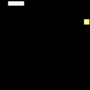
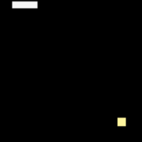

# Snake

This project focuses on the artificial intelligence of the [Snake](https://en.wikipedia.org/wiki/Snake_(video_game)) game. The snake's goal is to eat the food continuously and fill the map with its bodies ASAP.

## Build Status

| Linux | Windows | Python |
|:-----:|:-------:|:------:|
|[](https://travis-ci.org/chuyangliu/Snake)|[](https://ci.appveyor.com/project/chuyangliu/snake/branch/master)||

## Installation

- Requirements: Python 3.5+ with [Tkinter](https://wiki.python.org/moin/TkInter) installed.

- Run:

    ```
    $ python3 run.py
    ```

## Outline

| Solver | Demo |
|:------:|:----:|
|Hamilton||
|Greedy||

## License

See the [LICENSE](./LICENSE) file for license rights and limitations.
