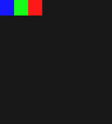
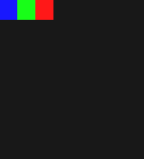
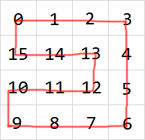
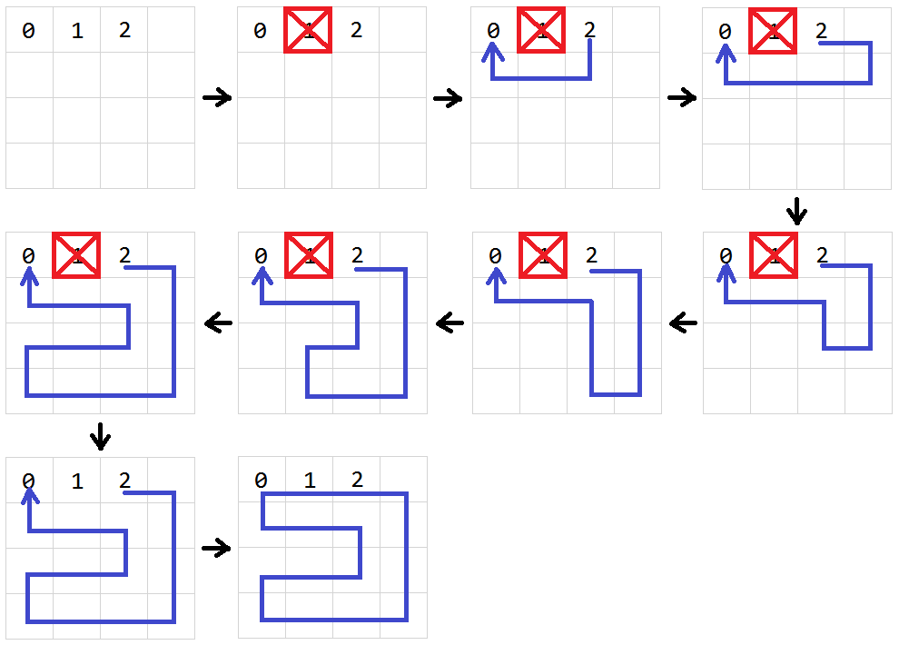
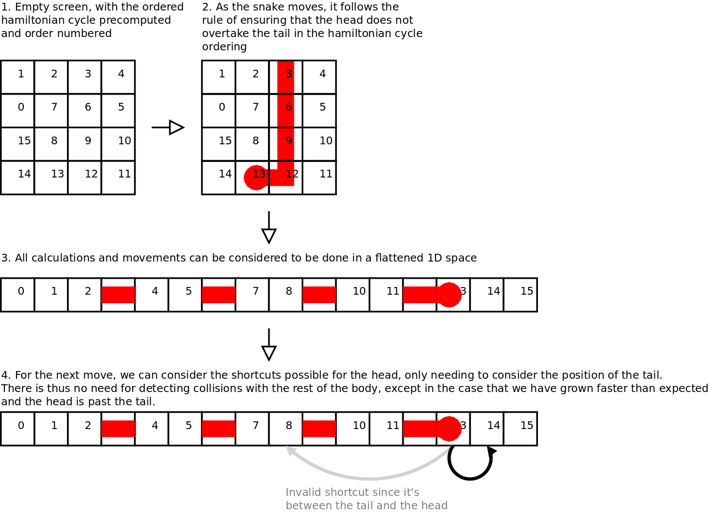

# Snake

This project focuses on the AI algorithm of the snake game. The AI's goal is to direct the snake to eat the food and fill the map with its body as quickly as possible, so it **should not** just follow a fixed pattern(e.g., zigzagging).

There are some pertinent discussions [here](https://www.reddit.com/r/programming/comments/5ly972/ai_algorithm_of_snake_game_share_opinions_if_you/).

## Build Status

| Linux | Windows |
|:-----:|:-------:|
|[](https://travis-ci.org/stevennl/Snake)|[](https://ci.appveyor.com/project/stevennl/snake/branch/master)|

## Demo

- AI based on the hamiltonian cycle, slower but easier to succeed.

    

- AI based on graph search, faster but harder to succeed.

    

## Installation

1. Install [CMake](https://cmake.org/download/).

2. Generate build files using the commands below:

    ```bash
    $ mkdir build
    $ cd build
    $ cmake ..
    ```

3. Build files will be generated in the `build` directory based on your operating system. Use them to build this project:

    | Linux | OS X | Windows |
    |:-----:|:----:|:-------:|
    |Makefile|Makefile|Visual Studio Project|

## Keyboard Controls

| Key | Feature |
|:---:|:-------:|
|W|move up|
|A|move left|
|S|move down|
|D|move right|
|Space|pause/resume the snake|
|Esc|exit game|

**Tips:** When the snake is running, you could press the `Space` key to pause the snake and then press the `W/A/S/D` key to move the snake step by step. Anytime if you want the snake to start running again, just press the `Space` key again.

## Algorithm

- [Shortest path](#shortest-path)
- [Longest path](#longest-path)
- [AI Algorithm](#ai-algorithm)

### Shortest path

Source: [Snake.findMinPath()](./src/model/Snake.cpp#L241)

We use breadth-first search to find the shortest path. We additionally expect the path to be as straight as possible so there will be less scattered empty points on the map, which will improve the AI's success rate.

The image below illustrates how this algorithm works on a 18*18 map. The green area is scanned when searching and the red area is the shortest path. Each number on the point denotes its minimum distance to the starting point.


### Longest path

Source: [Snake.findMaxPath()](./src/model/Snake.cpp#L285)

Suppose we want to find the longest path from point A to point B on a 4*4 map. The algorithm generates the shortest path between the two points first and then extends each pair of points on the path until no extensions can be found. Since the longest path problem is NP-hard, this algorithm is only an approximation.


The image below shows the longest path generated in a 18*18 map, where point 0 and point 1 is the beginning and the ending point respectively.
    


### AI Algorithm

This is a widespread picture of a perfect snake:


From the picture we can figure out that in order to fill the map with the snake's body, the whole body must form a hamiltonian cycle when the game ends. To ensure a hamiltonian cycle exists, the map must have **even(not odd)** amount of rows or columns.

There are two versions of AI algorithm to guide the snake, the first one is [based on graph search](#ai-based-on-graph-search) and the other is [based on the hamiltonian cycle](#ai-based-on-the-hamiltonian-cycle). Both of them are implemented in [Snake.decideNext()](./src/model/Snake.cpp#L115).

#### AI based on graph search

To find the snake(**S1**)'s next moving direction(**D**), the AI follows the steps below:

1. Compute the shortest path **P1** from snake **S1**'s head to the food. If **P1** exists, go to step 2. Otherwise go to step 4.
2. Direct a virtual snake, **S2**(the same as **S1**), to eat the food along path **P1**.
3. Compute the longest path **P2** from snake **S2**'s head to its tail. If **P2** exists, let **D** be the first direction in path **P1**. Otherwise go to step 4.
4. Compute the longest path **P3** from snake **S1**'s head to its tail. If **P3** exists, let **D** be the first direction in path **P3**. Otherwise go to step 5.
5. Let **D** be the direction that makes the snake the farthest from the food.

#### AI based on the hamiltonian cycle

The algorithm [generates a hamiltonian cycle](#generate-a-hamiltonian-cycle) on the map first and then moves the snake along the cycle. To avoid following this fixed cycle incessantly, the snake must have the ability to [take shortcuts](#take-shortcuts) to eat the food whenever possible.

##### Generate a hamiltonian cycle

Source: [Snake.buildHamilton()](./src/model/Snake.cpp#L395)

Suppose we want to build a hamiltonian cycle on a 4*4 map. Then our goal is to assign the path index to each point on the map. The image below shows a possible hamiltonian cycle.



To construct the cycle above, we fix the point 0, 1 and 2 first since they are the initial positions of the snake. Then we make point 1 unreachable and generate the longest path from point 2 to point 0. Finally we join the starting and the ending point, which forms a hamiltonian cycle:



##### Take shortcuts

Sometimes the snake can eat the food directly(take shortcuts) instead of following the hamiltonian cycle. The image below explains this idea briefly. For more details, please refer to [this article](https://johnflux.com/2015/05/02/nokia-6110-part-3-algorithms/).



## License

See the [LICENSE](./LICENSE) file for license rights and limitations.
