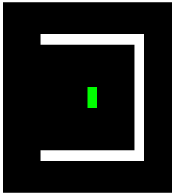
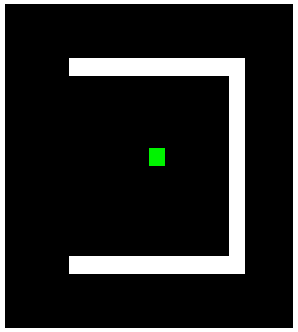
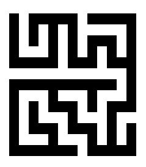

# Snake-AI

A snake game AI written in c/c++.

The goal is to eat all the food and make the map fill with the snake's bodies. 

To contribute, please see [todos](#todos).

## What can this program do?

* Play classic snake game.

* Watch how an AI snake eat food.

* Used as a console/terminal graphics library.

## Getting Started

Compile and run

```bash
$ make
$ make run
```

For usage, see function [main()](./src/main.cpp)

## Keyboard Control

| Key | Feature |
|:---:|---------|
|W|move up|
|A|move left|
|S|move down|
|D|move right|
|Space|pause/resume the snake|
|Esc|exit game|

## Demo

* Snake AI

  
   
Graph algorithms (green area is scanned when searching and red area is the path)

* Dijkstra

  

* Dijkstra + A*

  

Other algorithms

* Maze generate

  

## How does the AI algorithm work?

[Map.findMinPath()](./src/Map.cpp): compute the shortest path between two positions.

[Map.findMaxPath()](./src/Map.cpp): compute the longest path between two positions.

[Snake.decideNext()](./src/Snake.cpp): compute the next move direction(***D***) of the snake, the procedure is:

1. Compute the shortest path(***P1***) from the origin snake(***S1***)'s head to food.
 
2. Move a virtual snake ***S2***(the same as ***S1***) to eat the food along ***P1***.
 
3. Compute the longest path(***P2***) from the ***S2***'s head to its tail. If ***P2*** exists, let ***D*** be the first direction in ***P1***. Otherwise go to step 4.
 
4. Compute the longest path(***P3***) from the ***S1***'s head to its tail. If ***P3*** exists, let ***D*** be the first direction in ***P3***. Otherwise go to step 5.
 
5. Let ***D*** be the direction that makes the snake the farthest from food.

For more in Chinese, please see [中文博客](http://blog.csdn.net/qq_22885773/article/details/51888925).

## Todos

Optimize AI algorithm:

AI algorithm is imperfect since the snake sometimes moves to an insoluable situation(just run the program and you will see).

Some possible solutions:
  
| # | Solution | Implemented? | Comment |
|:-:|----------|:------------:|---------|
|1|~~Do not create food at the points whose adjacent points contain a snake's head and a snake's tail~~|No|Although effective, this is a tricky solution since it modifies the game rules instead of the AI algorithm itself. Thus there is no need to implement it.|
|2|Make the search path contain as few corners as possible, namely as straight as possible|No|How to modify the search algorithm to implement this?|

**You could contribute by commenting or implementing the solutions above or by adding new possible solutions.**

## License

See the [LICENSE](./LICENSE.md) file for license rights and limitations.
